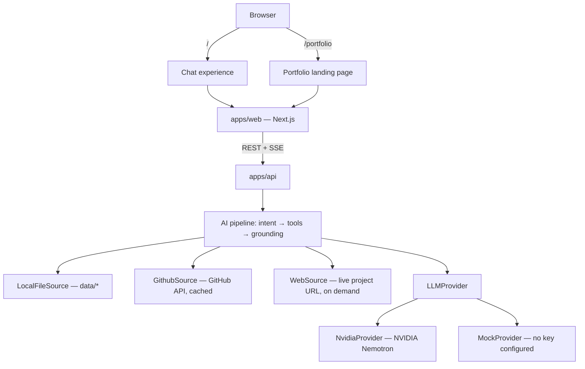
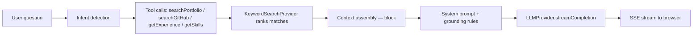

# Architecture

## Product shape

This is not a portfolio with a chatbot bolted on. The AI chat *is* the primary
interface; the classic landing page (`/portfolio`) is the alternate mode. Both
read from the same API and the same underlying data. The landing page
currently renders a "coming soon" placeholder while that mode is rebuilt —
its old section components were removed rather than left as dead code; the
API endpoints backing them (`/api/experience`, `/api/skills`, etc.) stay in
place either way, since the chat pipeline reads the same underlying
repository directly.



## Why one Next.js app instead of three micro-frontends

The original design brief called for `web-shell` + `chat-web` + `portfolio-web`
as three separately deployable Next.js apps stitched together with multi-zone
routing. For a single-owner personal portfolio, that adds real operational
cost (three build pipelines, three deploy targets, cross-zone navigation
quirks) for a benefit — independent team ownership and deployment — that
doesn't apply here. Instead, `apps/web` uses internal module boundaries that
mirror the intended separation:

- `src/features/chat/` — everything the AI chat experience owns
- `src/features/portfolio/` — everything the landing page owns
- `src/components/` — shared shell chrome (nav, theme, command palette)

If this project ever needs genuine independent deployability (e.g. a second
team owns the chat surface), these folders are already the seam to split
along.

## Why one backend instead of two

The original brief asked for parallel FastAPI (Python) and Express
(TypeScript) implementations of the same contract. Per project decision, this
build is **TypeScript end-to-end** — `apps/api` is the only backend.
Dropping the second language halves the surface area (routing, AI
orchestration, retrieval, contact/webhook, tests) with no loss of
functionality, since nothing here depends on Python specifically. The API
contract (`packages/types`) is still the source of truth, so a second
implementation remains possible later without touching the frontend.

## Backend layering

`apps/api/src` follows a conventional layered structure:

```
config/          env loading + validation (zod)
controllers/      request/response handling per route — thin, no business logic
routes/           Express Router wiring: path + middleware -> controller
services/         business logic (chat pipeline, AI providers, retrieval, contact)
repositories/     data access — the only place that reads data/*.json
middlewares/      cross-cutting Express middleware (cors, rate limiting, error handling, request logging)
utils/            small shared helpers (logger)
```

Controllers never touch the filesystem or external APIs directly — they call
into `services/` and `repositories/`, which keeps each route handler a thin
wrapper. This mirrors the layering most product teams use for a small Express
service, so a new backend engineer can navigate by convention alone.

## Retrieval pipeline



- **No vector database.** The corpus is a personal portfolio — a few dozen
  documents. `SearchProvider` (`apps/api/src/services/retrieval/search.provider.ts`)
  is a keyword/topic scorer today; it's an interface specifically so
  embeddings can be swapped in later without touching callers.
- **Source priority**: explicit portfolio data (`data/*`) > GitHub > live
  project URLs. See `data/sources/README.md`.
- **Prompt injection mitigation**: everything retrieved from GitHub READMEs
  or fetched web pages is wrapped in `<context>` and explicitly labeled as
  reference data, not instructions (`services/chat/system-prompt.ts`, rule 7).
- **Contact is never AI-initiated.** The pipeline can only emit a
  `show_contact_form` action; the actual `createContactRequest` call happens
  only when a human submits the rendered form.

## LLM provider abstraction

`LLMProvider` (`services/chat/providers/llm-provider.ts`) has exactly one method:
`streamCompletion(messages): AsyncGenerator<string>`. Two implementations:

- `NvidiaProvider` — OpenAI-compatible streaming against
  `NVIDIA_BASE_URL`/`NVIDIA_MODEL`, used whenever `NVIDIA_API_KEY` is set.
- `MockProvider` — deterministic, zero-cost, summarizes only the retrieved
  `<context>` block (never invents facts) — used whenever no key is
  configured, so the app is fully demoable without any account.

Swapping to a different OpenAI-compatible provider means writing one new
class and changing `services/chat/providers/index.ts` — nothing else in the codebase changes.

## Data model

Structured content lives under `data/` as JSON (experience, projects, skills,
education, achievements) plus one long-form Markdown bio. It's loaded once at
process start (`repositories/portfolio.repository.ts`) — no database, because the dataset is
small, static, and version-controlled by design (see spec principle: don't
overengineer). Editing the portfolio means editing these files, not the code.

## Rendering

Both `/` and `/portfolio` are dynamically rendered (`export const dynamic =
"force-dynamic"` in `app/layout.tsx`) because their content comes from a
separately-deployed API. Static prerendering would freeze that content at
build time — or permanently bake in the safe-fallback `null` if the API
wasn't reachable during the build.
